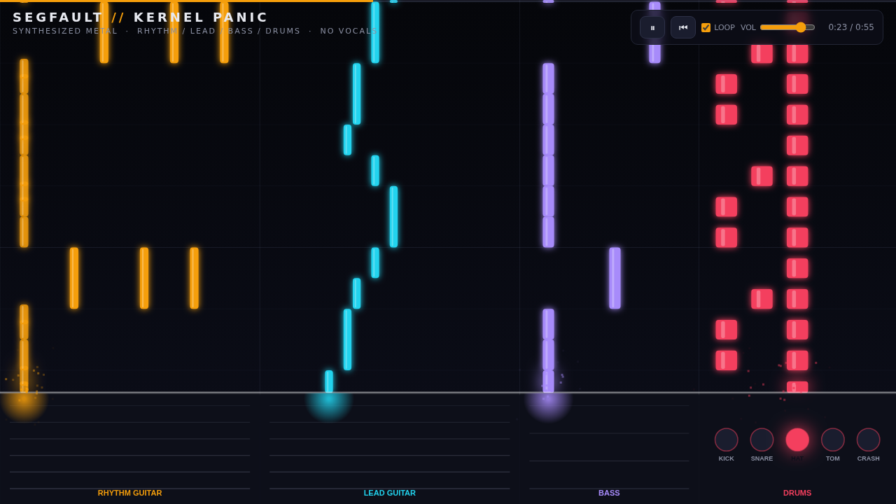

# SEGFAULT // Kernel Panic — Metal Band Visualizer

A Synthesia-style falling-notes visualizer, but for a **full metal band** instead of a piano —
rhythm guitar, lead guitar, bass, and drums. No vocals, no samples, no dependencies:
the song and every instrument sound are synthesized live in the browser with the Web Audio API,
and an animated character for each instrument performs on stage in sync with the notes.

## Run it

It's plain static files — no build step, no dependencies. Either:

- **Just open it:** double-click `index.html` (it runs fine over `file://`), or
- **Serve it:** `npm run dev`, then open the printed URL (http://localhost:5173).
  The dev server is a tiny zero-dependency Node script, so there's nothing to `npm install`.

Then click play. Turn it up. 🤘

## What you're looking at

Four columns of falling notes, each landing on its instrument's "deck" at the hit line:

| Column | Color | What it plays |
|---|---|---|
| Rhythm guitar | Amber | Palm-muted gallops, power-chord stabs, breakdown chugs |
| Lead guitar | Cyan | Melody with vibrato + delay, octave climaxes, fast runs |
| Bass | Purple | Locked to the rhythm guitar's roots, an octave down |
| Drums | Red | Kick / snare / hi-hat / tom / crash lanes, double-kick sections |

## Tracks

Three original instrumentals, switchable live from the selector (top-left) or keys **1 / 2 / 3**.
Switching rebuilds the band and restarts from the top; all loop by default.

| # | Track | Feel |
|---|---|---|
| 1 | **Kernel Panic** | E minor · 160 BPM · galloping thrash — intro build → main riff → lead section → half-time breakdown → double-kick finale |
| 2 | **Null Pointer** | A minor · 184 BPM · melodic speed metal — driving 8ths, a soaring chorus lead, and a pentatonic solo |
| 3 | **Stack Overflow** | E · 140 BPM · half-time groove — syncopated chugs, a bluesy mid-section, and a heavy breakdown |

## The band

Each instrument has a character on stage, animated entirely from the note data:

- **Guitarists & bassist** — strum on every hit, their fret hand slides along the neck to
  follow the pitch being played, and they headbang on the beat (harder after chord stabs).
  The lead guitarist leans back during sustained vibrato notes.
- **Drummer** — sits behind a drawn kit (kick / snare / hi-hat / tom / crash). The falling
  drum notes land on the actual kit pieces, the sticks swing to whichever piece was hit,
  and the kick flashes on the double-kick runs.

## How it works

- **Composition** — each song is a builder function in `app.js` that writes step-sequencer
  data (a 16th-note grid at the song's tempo) using shared riff/beat helpers. Switching
  tracks reloads that data and rebuilds the audio schedule.
- **Sound** — two engines, switchable live with the **8-BIT / METAL** button:
  - **8-bit (default)** — video-game-style chiptune metal: 25%-duty pulse-wave rhythm
    chords, square-wave lead with vibrato and arcade echo, NES-style triangle bass, and
    noise-channel drums. Punchy and clean by construction.
  - **Metal (amp sim)** — **Karplus-Strong plucked strings** (palm mutes heavily damped,
    open chords ring) through a tanh `WaveShaperNode` amp with cab-sim EQ; 808-style
    square-bank cymbals; generated-impulse-response convolver reverb.
- **Visuals** — a single `<canvas>` renders the falling notes (lookahead of 2.4 s), moving
  beat grid, hit-line sparks, pulsing spotlights, and the four performers.
- **Sync** — audio is scheduled with the standard Web Audio lookahead-scheduler pattern, and
  both the renderer and the characters derive their state from `AudioContext.currentTime`,
  so audio, notes, and animation can't drift.

## Controls

- **1 / 2 / 3** (or the selector) — switch tracks
- **Space / ⏸ button** — play / pause
- **⏮** — restart
- **8-BIT / METAL** — switch the sound engine on the fly
- **LOOP** — toggle looping
- **VOL** — master volume
